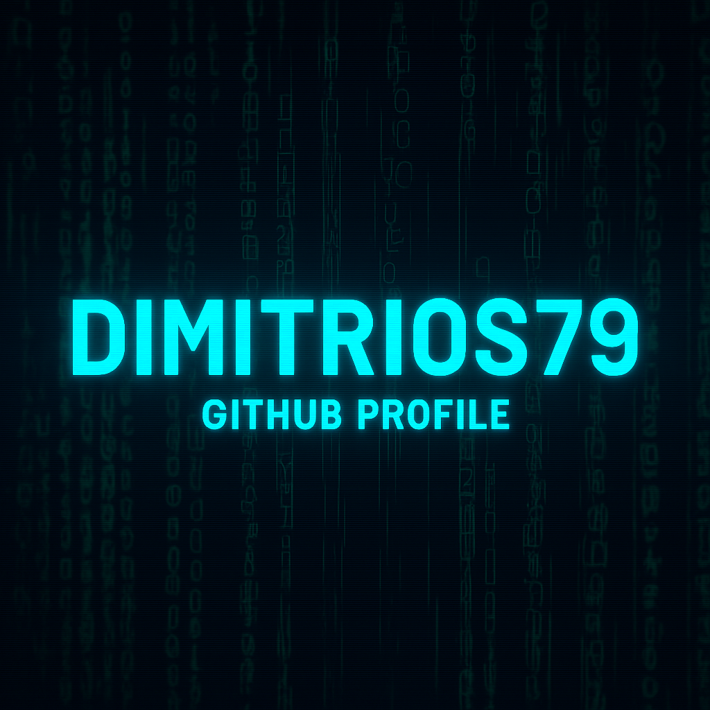

  

<h1 align="center">👋 Hi, I'm Dimitrios</h1>

  <b>AI Security Researcher · Cybersecurity Engineer · LLM Red Teaming</b> 
  Offensive & defensive security for enterprise systems and AI models.

---

## 🛡️ About Me

I am a **Cybersecurity Engineer with 8+ years of experience** in:

- 🔐 **Identity & Access Management (IAM)** — SailPoint, CyberArk, One Identity, Azure AD  
- 🛡 **Network Security** — WAF, DDoS (Akamai), firewall policies, VPNs  
- 🕵️ **Threat Analysis & Incident Response** — malware, social engineering, fraud patterns  
- 🧱 **AppSec & DevSecOps** — Snyk, Fortify, secure SDLC  
- ⚙ **Automation & Scripting** — Python, Bash  
- 📡 **IoT/SCADA Security** — smart meters, industrial sensors  

Recently, I expanded into **AI Security and LLM Red Teaming**, building hands-on research projects that evaluate the real-world attack surface of modern AI systems.

My goal: **secure both classical enterprise environments and next-generation AI models.**

---

## 🚀 Featured Projects

### 🔥 AI Red Teaming Security Lab
A full adversarial testing suite for LLMs & RAG systems:

- ✔ Garak vulnerability scanning  
- ✔ Prompt injection & hijacking  
- ✔ RAG poisoning (malicious document takeover)  
- ✔ AI attack success metrics  
- ✔ Defense prototypes  

👉 Repo: https://github.com/Dimitrios79/ai-redteaming-security-lab

---

## 🧠 Work Experience (Highlights)

### 🛡 Security Network Engineer — **Akamai Technologies** (2025–Today)
- WAF, DDoS, L1/L2 security support  
- Threat monitoring, incident handling  
- Process automation & documentation

### 🔐 IoT Cybersecurity Consultant — **Lutech Group**
- IAM architecture for IoT platforms  
- Smart meter security, automated provisioning policies

### 🛡 Cybersecurity Technical Manager — **14bydesign**
- CIS-based hardening  
- Enterprise security policies  
- IR readiness for major clients (Microsoft, Austria Card, Space Hellas)

### 🧪 Risk Advisory Consultant — **Deloitte**
- IAM consulting (public + private sectors)  
- AppSec testing with Snyk, Fortify

### 🔍 Threat Analyst — **Teleperformance (Netflix/Wish)**
- Fraud patterns, social engineering, anomaly investigation  

---

## 🧰 Tech Stack

  
  
  
  
  
  
  
  

---

## 🎓 Certifications

- CompTIA Security+  
- Certified Ethical Hacker (CEH)  
- CCNA  
- SailPoint / CyberArk / One Identity Certified  
- ML Coursework  

---

## 📫 Connect with Me

🔗 LinkedIn: *add your link here*  
🔗 GitHub: https://github.com/Dimitrios79  

---

  <i>“Offense informs defense — Securing enterprise systems and AI models.”</i>

